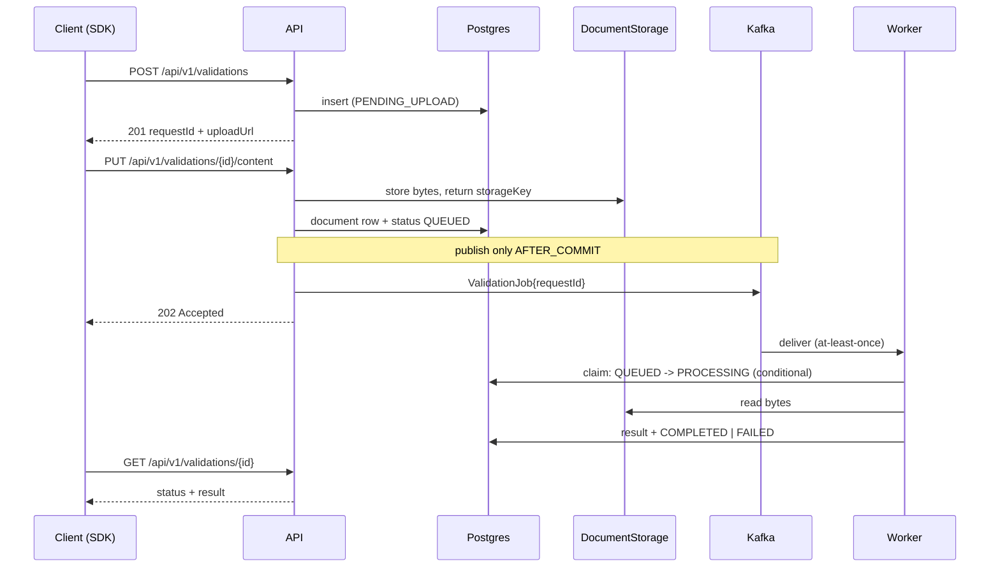

# Architecture

## Overview

A thin vertical slice of an asynchronous document-validation platform. A client
declares an intent to validate a document, uploads the bytes, and the service
processes the document off the request thread. The client either polls for the
result or lets the SDK poll on its behalf.



## Module layout

```
service/
  api/          controllers, DTOs, error handling
  domain/       ValidationRequest aggregate, status machine, entities
  persistence/  repositories, Liquibase changelogs
  messaging/    JobPublisher / JobConsumer ports + Kafka and local adapters
  storage/      DocumentStorage port + filesystem adapter
  processing/   DocumentValidator (deterministic stub)
```

The dependency rule is one-way: `api` and `messaging` depend on `domain`;
`domain` depends on nothing. Adapters are the only classes that know Kafka or
the filesystem exist.

The JPA annotations sit on the domain classes rather than on a parallel set of
persistence entities that get mapped back and forth. At this size the mapping
layer would cost more than it buys, and the thing worth protecting is that the
aggregate owns its transitions — not that it is ignorant of Hibernate. `domain`
therefore holds the entities; `persistence` holds the repositories and the
changelogs.

## Status machine

```
PENDING_UPLOAD --PUT /content--> QUEUED --worker claim--> PROCESSING --> COMPLETED
                                                                     \-> FAILED
PENDING_UPLOAD --TTL elapsed--> EXPIRED
```

The full transition table. Anything not listed is rejected with `409 Conflict`
and a problem body naming both the current and the attempted state.

| From | To | Trigger |
|---|---|---|
| `PENDING_UPLOAD` | `QUEUED` | Bytes uploaded and persisted |
| `PENDING_UPLOAD` | `EXPIRED` | Upload window elapsed without content |
| `QUEUED` | `PROCESSING` | Worker claims the job |
| `PROCESSING` | `COMPLETED` | Validator produced a verdict |
| `PROCESSING` | `FAILED` | Empty file, unsupported type, or processing error |

`COMPLETED`, `FAILED` and `EXPIRED` are terminal.

The guard lives on the aggregate as `ValidationRequest.transitionTo(next)`,
not as scattered `if` checks in the service layer. Invalid transitions throw
`IllegalStateTransitionException`, which the advice maps to 409. This keeps the
domain object responsible for its own invariants rather than leaving it an
anemic data holder that any caller can put into a nonsense state.

## Idempotency rules

These are contract, not implementation detail, and are restated in the README.

### `POST /api/v1/validations`

Accepts an optional `Idempotency-Key` header. The key is stored with a unique
constraint. A replay with the same key returns **the same** `requestId` with
`200 OK` rather than minting a second resource.

With no header, every call creates a new request. That is a deliberate choice,
not an oversight: creating a validation is cheap and the caller may legitimately
want several validations of the same filename. Callers that need
exactly-once creation opt in explicitly.

### `PUT /api/v1/validations/{requestId}/content`

The SHA-256 digest of the uploaded bytes is stored on the document row.

| Condition | Response |
|---|---|
| First upload, status `PENDING_UPLOAD` | `202`, transition to `QUEUED`, publish job |
| Re-upload, identical digest, status `PENDING_UPLOAD` or `QUEUED` | `200`, no state change, **no second job published** |
| Re-upload, different digest | `409` — content is immutable once accepted |
| Any upload once status is `PROCESSING` or terminal | `409` |

Retrying a timed-out upload is therefore safe, while silently swapping the
document under a request that has already been judged is not.

### Job consumption

The worker claims work with a conditional update rather than a read-then-write:

```sql
UPDATE validation.validation_request
   SET status = 'PROCESSING', ...
 WHERE id = ? AND status = 'QUEUED'
```

Zero rows affected means another consumer already claimed it, or the message is
a duplicate redelivery. The worker acks and drops it. This is what makes Kafka's
at-least-once delivery safe without any exactly-once machinery, and it is the
single assumption the whole async design rests on. There is a test that delivers
the same job twice and asserts exactly one result row.

## Messaging

Two ports, deliberately narrow:

```java
public interface JobPublisher { void publish(ValidationJob job); }
public interface JobConsumer  { void onJob(ValidationJob job); }
```

| Adapter | Profile | Use |
|---|---|---|
| `KafkaJobPublisher` | `kafka` (default) | Local runs and the demo |
| `LocalJobPublisher` | `local` | Tests, and running without a broker |

`LocalJobPublisher` exists for a reason beyond convenience: a port with one
implementation is an assertion, not a demonstration. Two adapters prove the
business logic does not know which one is wired. It also keeps the unit and
WebMvc tests broker-free, so only one integration test pays Kafka startup.

The consumer is identical on both paths. Swapping to MSK later is a
configuration change plus a new `JobPublisher` bean; no domain code moves.

### Publishing after commit

Both adapters publish from a `@TransactionalEventListener(phase = AFTER_COMMIT)`.
Publishing inside the transaction would let a job reach the broker for a
transaction that then rolled back, producing a message whose `requestId` does
not exist. Publishing after commit inverts the failure: if the broker is
unreachable the row is committed as `QUEUED` but no message is sent, and the
work is stranded rather than phantom.

That is the better failure to have, but it is still a gap. The correct fix is a
transactional outbox — write the message to an outbox table in the same
transaction, relay it separately — plus a sweeper that re-publishes rows stuck
in `QUEUED` past a threshold. Deliberately out of scope here; noted in the
README as next work.

### Failure handling

A validator error marks the request `FAILED` with a reason and acks the message.
It does not rethrow. Rethrowing on a non-transient failure would redeliver the
same poison message forever and block the partition. The consequence is that a
genuinely transient fault is also recorded as `FAILED` rather than retried; a
retry topic plus a DLQ is the next step, and is what a production version needs.

## Persistence

PostgreSQL, schema `validation`, so the service owns its namespace and could be
extracted without a table-name collision.

| Table | Purpose |
|---|---|
| `validation_request` | Aggregate root: status, timestamps, idempotency key, version |
| `document` | Filename, content type, size, SHA-256, storage key |
| `validation_result` | Verdict, extracted fields (`jsonb`), reason |

Notes:

- `version` column for optimistic locking on the aggregate.
- Unique index on `idempotency_key` where not null.
- Index on `status` — the stuck-job sweeper will need it.
- Result is a separate table rather than nullable columns on the request, so
  "no result yet" is the absence of a row rather than a wall of nulls.

Migrations use **Liquibase**, as the brief prefers. One changeset per file,
included from `changelog-master.xml`. Changesets are never edited after commit;
corrections go in a new changeset, because Liquibase checksums an applied
changeset and a rewritten one fails on every environment that already ran it.

## Storage

`DocumentStorage` port with a `LocalFilesystemStorage` adapter writing under
`./.data/{requestId}`. The database stores the storage key, never the bytes.

Keeping the key rather than a path means the S3 adapter is a drop-in. The happy
path requires no AWS account, as the brief demands. The natural next step is a
real presigned `PUT`, at which point the `uploadUrl` returned by create points
at S3 instead of at this service and the `confirm` endpoint carries its weight.

## API

Base path `/api/v1`.

| Method | Path | Behaviour |
|---|---|---|
| `POST` | `/validations` | Create. Returns `requestId`, `uploadUrl`, `status`, `expiresAt` |
| `PUT` | `/validations/{requestId}/content` | Upload bytes. `202` on accept |
| `GET` | `/validations/{requestId}` | Status, plus result once terminal |
| `GET` | `/actuator/health` | Liveness |

`POST /validations/{requestId}/confirm` is intentionally **not** implemented.
With a service-hosted `PUT` the upload response is itself the confirmation, so a
confirm endpoint would be a no-op that exists only to look complete. It becomes
necessary the moment uploads go directly to S3, and is listed as next work.

### Errors

RFC 9457 `ProblemDetail`, produced by a single `@RestControllerAdvice`, carrying
a stable machine-readable `code` alongside the standard fields so the SDK can
branch on something other than prose:

```json
{
  "type": "https://docvalidate.dev/problems/invalid-state-transition",
  "title": "Invalid state transition",
  "status": 409,
  "detail": "Cannot upload content to a request in status PROCESSING",
  "instance": "/api/v1/validations/0f9c...",
  "code": "INVALID_STATE_TRANSITION",
  "requestId": "0f9c..."
}
```

Input validation is `jakarta.validation` on the request DTOs; constraint
violations map to `400` with the offending fields listed.

## Processing stub

Deterministic, no I/O beyond reading the stored bytes:

- Empty file -> `FAILED`, reason `EMPTY_DOCUMENT`
- Content type outside the allowed set -> `FAILED`, reason `UNSUPPORTED_CONTENT_TYPE`
- Otherwise -> `COMPLETED` with a verdict derived from filename and content type

An artificial delay makes the asynchronous lifecycle observable, so the SDK's
`waitForCompletion` is genuinely exercised rather than passing because the work
happened to finish before the first poll.

## Trade-offs

| Decision | Chosen | Rejected | Why |
|---|---|---|---|
| Upload path | Service-hosted `PUT` | Real presigned S3 | Brief forbids requiring AWS on the happy path |
| Publish timing | `AFTER_COMMIT` | In-transaction | Never publish a job for a rolled-back write |
| Delivery guarantee | At-least-once + idempotent claim | Exactly-once | Idempotent consumers are simpler and survive redelivery |
| Content re-upload | `409` on digest mismatch | Overwrite | Silent substitution under an in-flight validation |
| Migrations | Liquibase | Flyway | Brief prefers it; no reason to diverge |
| Result storage | Separate table | Nullable columns | Absence of a row models "not yet" honestly |
